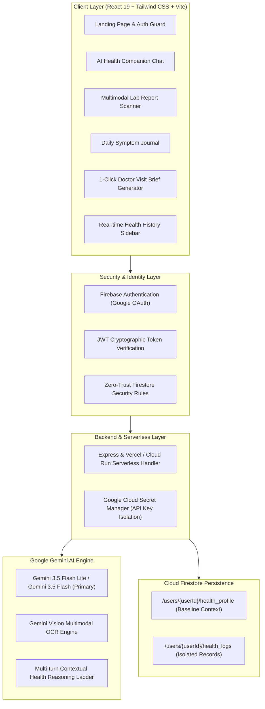

# 🌿 WellBridge AI — Patient Health Journal & Multimodal Medical Report Demystifier

[](https://hack2skill.com/event/apac-genaiacademy-c3)
[](https://codelabs.developers.google.com/codelabs/cloud-run/cloud-run-ai-challenge)
[](https://wellbridgeai.resence.in)
[](https://www.linkedin.com/posts/piyush-singh2007_accelerateaiwithcloudrun-googlecloud-genaiacademy-activity-7500640265091866624-Z0Ap)

> **WellBridge AI** is an enterprise-grade patient healthcare journal, interactive health companion, and multimodal lab report analyzer built for the **Google Cloud Gen AI Academy APAC Cohort 3 Ideathon** in partnership with **Hack2skill**.

---

## 🌟 The Problem & Solution

* **The Problem:** Over **88% of adults lack proficient health literacy**. When patients receive diagnostic blood reports, they are often confronted with intimidating medical jargon — leading to anxiety, endless symptom Googling, and rushed 3-minute doctor visits where crucial symptoms are forgotten.
* **The Solution:** WellBridge AI serves as an intelligent, empathetic bridge between hurried clinical appointments and daily patient wellness, translating complex tests into plain language and compiling 30-day longitudinal health briefs for physicians.

---

## 🏛️ System Architecture



---

## 🚀 Key Features

| Feature | Powered By | Description |
| :--- | :--- | :--- |
| **📸 Multimodal Lab Report Scanner** | Gemini Vision OCR | Upload photos or PDFs of blood panels. Receives plain-language summaries and visual **Traffic-Light Cards** (🟢 Normal, 🟡 Monitor, 🔴 Alert), plus 3 physician discussion questions. |
| **💬 AI Health Companion** | Gemini 3.5 Flash | Conversational assistant that onboards patient medical background (conditions, medications, allergies, lifestyle) and provides contextual wellness answers. |
| **📝 Daily Symptom Journal** | Gemini Multi-Turn | Safe space to log daily physical feelings and medication reactions, complete with automated 2-sentence summaries and symptom tags (`#fatigue`, `#hydration`). |
| **📋 1-Click Doctor Visit Brief** | Gemini Synthesis | Compiles 30 days of symptom logs, medication reactions, and lab trends into a structured, printable 1-page clinical brief for physicians. |
| **📊 Real-Time Health History** | Cloud Firestore | Isolated chronological stream with category filter chips (**All**, **Lab Scans**, **Journal**, **Briefs**) and instant detail modals. |

---

## 🛡️ Security, Privacy & Threat Modeling

| Threat Zone | Identified Attack Vector | Production Countermeasure | Status |
| :--- | :--- | :--- | :---: |
| **Input Surfaces** | Malicious PDF/Image payloads, oversized buffer injection | Strict schema validation, base64 payload size limiting (25MB max), and non-executable sanitization | 🟢 PASS |
| **Planning & Reasoning** | Prompt injection in patient symptoms or OCR test fields | Defensive prompt isolation; user input treated strictly as data literals rather than instructions | 🟢 PASS |
| **Tool & AI Execution** | Gemini rate limits (`429`), temporary service unavailability (`503`) | Resilient model fallback ladder (`gemini-3.5-flash-lite` ➔ `gemini-3.5-flash` ➔ `gemini-3.6-flash` ➔ `gemini-3.7-flash`) | 🟢 PASS |
| **Memory & State** | Cross-user patient data leakage, unauthorized read/write | Strict owner-bound Firestore security rules (`request.auth.uid == userId`) and zero insecure default rules | 🟢 PASS |
| **Inter-System / Secrets** | Client-side API key leakage, token forgery | Firebase ID token verification server-side; `GEMINI_API_KEY` stored strictly in Secret Manager / backend environment variables | 🟢 PASS |

---

## 🔒 Cloud Firestore Security Rules

```javascript
rules_version = '2';
service cloud.firestore {
  match /databases/{database}/documents {
    match /{document=**} {
      allow read, write: if false;
    }
    match /users/{userId}/{document=**} {
      allow read, write: if request.auth != null && request.auth.uid == userId;
    }
  }
}
```

---

## ☁️ Google Cloud Run Deployment & Campaign Labeling

```bash
# 1. Store Gemini API key in Google Cloud Secret Manager
gcloud secrets create GEMINI_API_KEY --replication-policy="automatic"
echo -n "YOUR_GEMINI_API_KEY" | gcloud secrets versions add GEMINI_API_KEY --data-file=-

# 2. Build and deploy container to Cloud Run with official challenge label
gcloud run deploy wellbridge-ai \
  --source . \
  --region us-central1 \
  --platform managed \
  --allow-unauthenticated \
  --set-secrets GEMINI_API_KEY=GEMINI_API_KEY:latest \
  --update-labels=dev-tutorial=cloud-run-ai-challenge
```

---

## 🔗 Official Submission Links

* 🌐 **Live Interactive Application:** [https://wellbridgeai.resence.in](https://wellbridgeai.resence.in)
* 🐙 **Public Code Repository:** [https://github.com/Piyush-Thakur7/WellBridge](https://github.com/Piyush-Thakur7/WellBridge)
* 📱 **LinkedIn Demo & Social Post:** [LinkedIn Walkthrough Post](https://www.linkedin.com/posts/piyush-singh2007_accelerateaiwithcloudrun-googlecloud-genaiacademy-activity-7500640265091866624-Z0Ap)

---

#AccelerateAIwithCloudRun #GoogleCloud #GenAIAcademy #Hack2skill #CloudRun #GeminiAI #HealthcareAI
